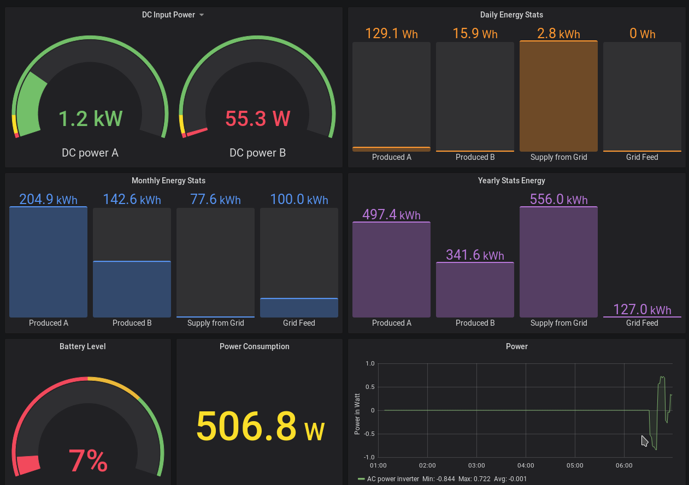

# Introduction

The data logger for RCT inverters was developed to the inverter data available not only in the mobile app provided by RCT but also in an own smart home solution. From this GitHub page you only need the latest jar file `rctDataServer-<version>.jar`, download the file with the highest version number (to be found in release folder). The application was developed in Java and should therefore run on Windows, Linux and macOS. The jar file can be saved somewhere on the hard disk.

# Requirements
## Java
Java must be installed. If you are not sure if you have Java installed, just type `java -version` in a command line window to see if Java is installed and what version. The application has been tested so far with 

- Sun Java 1.8 64-bit on Windows 
- Sun Java 1.8 64-bit on Raspberry Pi
- OpenJDK 11 on Linux

Other Java versions may or may not work.

## Configuration File
A configuration file must be created and adjusted before the first start. This file must have the name rctDataServer.properties, please pay attention to upper and lower case.

Please store this configuration file under Windows in `C:\Users\<User-Name>\AppData\Local\rctDataServerConfig`. The subdirectory rctDataServerConfig must be created by the user. If Linux is used please put the file in `/home/<user-name>/.local/share/rctDataServerConfig/`, if macOS is used please put it in `<user-home>/AppData/Local/rctDataServerConfig/`. Again, please pay attention to upper and lower case.

A sample config file can be found in the folder `exampleFiles` on GitHub. This sample includes Influx connectivity, without Influx the Influx parameters have to be removed. See further below for details on Influx.

The minimal content of the file should look like this:

```
hostnameInverter = 1.1.1.1
portInverter = 8899
logLevel = info
timeoutInverter = 3000
```
Attention, you have to adjust the first value and enter the IP address of your inverter. You might also have to change the second parameter, 8899 is the default port of the inverter. Hence, if you are not aware that you changed it, then please leave it as it is. The parameter timeoutInverter describes after how many ms it is not being waited anymore for a response from the inverter. For unknown reasons the inverter does not always seem to respond, it rarely happens but should not block the further process. If you see a lot of timeout messages in the log, you could increase the value a bit. The parameter logLevel uses the usual values. Most important are _error_, _info_ and _debug_. In production use error to initially see what happens info and debug for development problems.

By default, the system logs into the directory where the tool was started from into a file rctPower.log, but you can specify a log location with the optional parameter

```
logFile = /home/myuser/rctPower.log
```
Make sure to specify the full path and filename. If there is the need to see log information before the log config was read, then that information is held in the current directory in the file rctPowerStartup.log, in most cases this log file will be empty.

The log file configuration is possible since version 0.1.5.


Optionally you can enter the following parameters

```
panelPower = 200
panelsA = 10
panelsB = 12
```
These are purely optional parameters and are used to check whether the values determined are correct. If discrepancies are found, they are logged. PanelPower is the power of a single solar module in Watt, panelsA and panelsB are the number of modules in string A and B respectively. The above values are only exemplary here and have to be adjusted due to the actual installation.

# Application
## Start-up
Depending on how your computer is configured you can start Java programs in different ways. On some computers you can start them with a double click, I would always start them on the command line to see what happens.
Open a command line window, then navigate to the directory where you put the jar file. In the directory `java -jar rctDataServer-<version>.jar`. Some messages will run across the screen, after a few seconds the output should stop and you should see 

```
<<<<< INFO >>>>> Inverter::connect Connected successfully to inverter. 
```
Now the connection is established.

## Simple Usage
There are several ways to use the application. The easiest way is via a browser
(tested with Chrome and Firefox) to call the URL 'http://localhost:8080/charts.html'. This gives you access to a simple UI. This simple UI has only limited functionality and is not intended to replace a complete reporting application.

## Influx Connection
Mainly the tool was built to store the data in an Influx DB. The data of the Influx DB can be used to be evaluated via Grafana (or other applications). To realize the connection to Influx you just have to set the connection parameters in the configuration file above

```
influxdbServer = localhost
influxdbPort = 8086
```
The server name and the server port have to be adjusted according to the Influx installation. By default a measurement value is requested every minute and stored in the InfluxDB. A Grafana dashboard might look like as in the following example:



In the directory `Grafana` you will find a Grafana dashboard which you can import to get started. If you want to create your own dashboards and share them with other users, then send them across and I will place them here on GitHub as well. The dashboard gets its data from a DataSource called InfluxDB, this DataSource has to be created manually in Grafana first, please use exactly this name. You need to specify as well a database name for this DataSource, please use rctdb. To import the dashboard into Grafana, click on the Home icon on the dashboard home screen and then select Import Dashboard from the menu.

### Configuration which data are stored in Influx
This possibility exists starting from version 0.1.5.
On GitHub a `CSV file RCT_magic_numbers.csv` exists in the directory exampleFiles. In there it is defined which data will be written to Influx, the entries look like this

```
C0CC81B6;Eac - Energy this year in Wh ;short;rctdb;
B1EF67CE;Eac - Total energy in Wh ;short;rctdb;EnergyTotal
```

The first value is a code coming from the inverter, please do not change it. The next value is a description, then the data type (do not change it either, it must match the code in the first field), then the name of the Influx database and then the parameter name (Measurement) in the database. If the parameter name is omitted, it means that the value is simply not written into Influx. With that you can control which values are written to the database and which are not. ATTENTION: In the example above, please note that there must be a semicolon after the database, but must not after the parameter name.

A CSV file adapted in such a way is read if it is in the same directory as the configuration file, if the CSV file is missing then an internal standard configuration is taken. In other words, this file is purly optional.

No lines should be deleted in the CSV because the data logger knows through this file which codes exist, if a value is not needed in the database then simply remove the parameter name from the corresponding line.

## Technical test
Another way to retrieve data is to use a browser to request certain values. Basically this is a good way to test if the application is running. Otherwise you can also use this http interface if you want to integrate the data into your own applications.

For example to get the input voltage at string A open the URL

```
http://localhost:8080/getData?magicNumber=B55BA2CE
```
As always, please pay attention to upper and lower case. You will get a so called JSON file displayed in your browser


```json
{"type": "short", "magicNumber": "B55BA2CE", "value":530.0684, "text": "DC input voltage A in V", "timestamp":1601104412, "success":true}
```
Important for the first time is only the value in 'value', or that you get such an answer at all. Further details are only important if you want to write your own application and query the data this way. For more details please see the developer documentation. The value of the URL parameter `magicNumber` is exactly the code of the previously described CSV file. From that CSV file you can select codes you can use to retrieve needed data.

